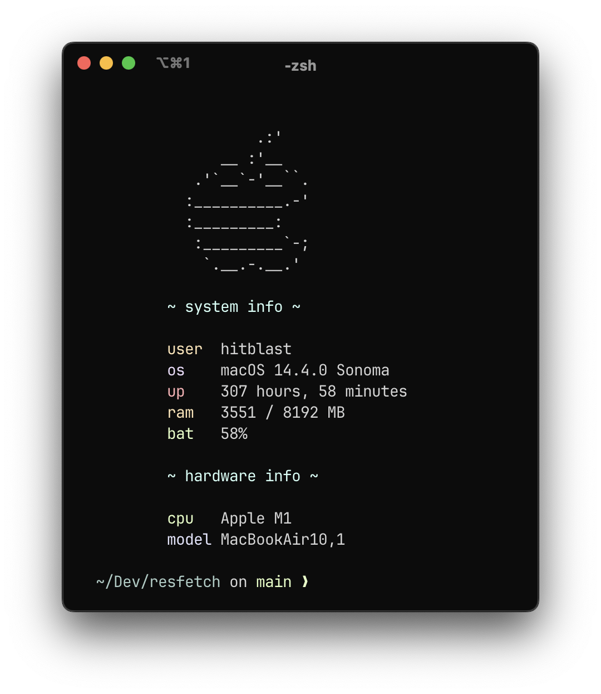

<div align="center">

#  resfetch
### A fast and minimal alternative to neofetch

[](https://crates.io/crates/resfetch)
[](https://github.com/hitblast/resfetch/actions/workflows/build.yml)
[](https://github.com/hitblast/resfetch/actions/workflows/release.yml)

 <br>

</div>

## Installation

### Cargo
```bash
$ cargo install resfetch
```

### Homebrew
```bash
# tapping the formula
$ brew tap hitblast/resfetch

# installing it
$ brew install resfetch
```

### Docker
```bash
# building image
$ docker build -t resfetch .

# running
$ docker run resfetch
```

## Dependencies Used
- [libmacchina](https://github.com/Macchina-CLI/libmacchina)
- [colored](https://crates.io/crates/colored)

## Contributing
A [contribution guideline](./CONTRIBUTING.md) and a [Code of Conduct](./CODE_OF_CONDUCT.md) has been placed to further faciliate open-source contributions. We hope that you won't hesitate adding your ideas here!
