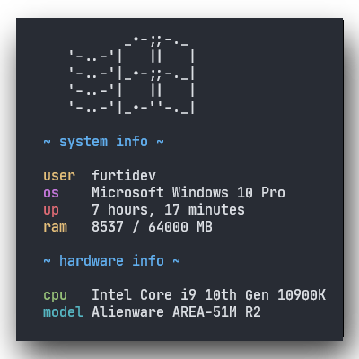

<div align="center">
<h1>resfetch</h1>

A fast and minimal alternative to neofetch

<a href="https://crates.io/crates/resfetch">
    
</a>

 <br>
<sub><sup>(this isn't my spec lol)</sup></sub>

</div>

## Installattion
### Cargo
```bash
$ cargo install resfetch
```

### Homebrew
```bash
# tapping the formula
$ brew tap hitblast/resfetch

# installing it
$ brew install resfetch
```

## Third-party libs I used
- [libmacchina](https://github.com/Macchina-CLI/libmacchina)
- [colored](https://crates.io/crates/colored)
